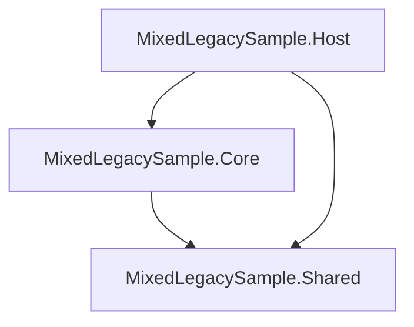
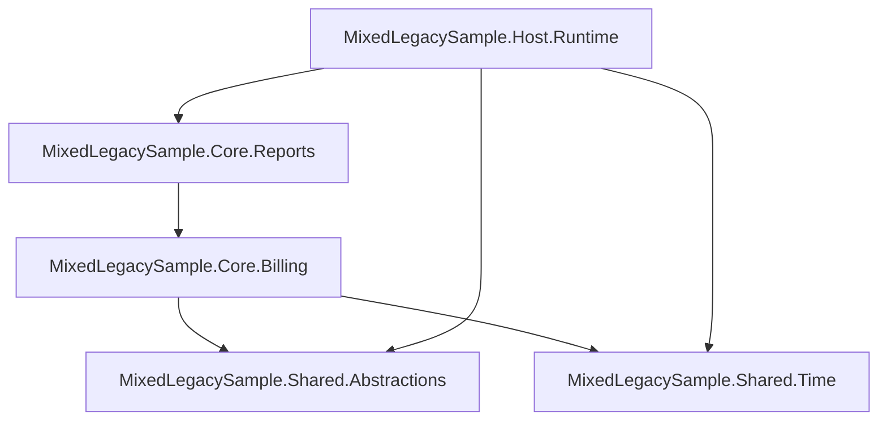
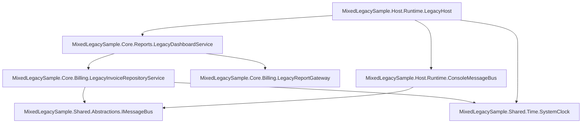
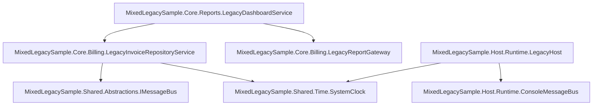

# Dependency Explorer Report

Generated from `MixedLegacySample.slnx`.

## Summary

Input path: `MixedLegacySample.slnx`

## Scope

- Level: All
- Focus project: none
- Focus namespace: none
- Focus class: none

## Counts

- Projects: 3
- Package references: 0
- Documents: 18
- Named types: 7
- Project dependency edges: 3
- Namespace dependency edges: 18
- Type dependency edges: 24
- Internal type dependency edges: 12
- External type dependency edges: 12
- Constructor DI edges: 6

## Analysis Options

- Classification: enabled
- Constructor DI graph: enabled

## Workspace Diagnostics

- None

## Projects

- `MixedLegacySample.Core`
  Path: `MixedLegacySample.Core/MixedLegacySample.Core.csproj`
  Frameworks: net10.0
  Documents: 6
  Project references: MixedLegacySample.Shared
  Package references: none

- `MixedLegacySample.Host`
  Path: `MixedLegacySample.Host/MixedLegacySample.Host.csproj`
  Frameworks: net10.0
  Documents: 6
  Project references: MixedLegacySample.Core, MixedLegacySample.Shared
  Package references: none

- `MixedLegacySample.Shared`
  Path: `MixedLegacySample.Shared/MixedLegacySample.Shared.csproj`
  Frameworks: net10.0
  Documents: 6
  Project references: none
  Package references: none

## Top Type Fan-Out

- `MixedLegacySample.Host.Runtime.LegacyHost`: 3
- `MixedLegacySample.Core.Billing.LegacyInvoiceRepositoryService`: 2
- `MixedLegacySample.Core.Reports.LegacyDashboardService`: 2
- `MixedLegacySample.Host.Runtime.ConsoleMessageBus`: 1

## Top Type Fan-In

- `MixedLegacySample.Shared.Abstractions.IMessageBus`: 2
- `MixedLegacySample.Shared.Time.SystemClock`: 2
- `MixedLegacySample.Core.Billing.LegacyInvoiceRepositoryService`: 1
- `MixedLegacySample.Core.Billing.LegacyReportGateway`: 1
- `MixedLegacySample.Core.Reports.LegacyDashboardService`: 1
- `MixedLegacySample.Host.Runtime.ConsoleMessageBus`: 1

## Key Findings

- [warning] Project 'MixedLegacySample.Core' looks mixed: MixedLegacySample.Core.Billing.LegacyInvoiceRepositoryService classified as Mixed

## Inventory

| Project | Classification | Documents | Package refs | Project refs | Notes |
| --- | --- | ---: | ---: | ---: | --- |
| MixedLegacySample.Core | Mixed (Medium) | 6 | 0 | 1 | MixedLegacySample.Core.Billing.LegacyInvoiceRepositoryService classified as Mixed |
| MixedLegacySample.Host | Presentation (Medium) | 6 | 0 | 2 | MixedLegacySample.Host.Runtime.LegacyHost classified as Presentation |
| MixedLegacySample.Shared | Unknown (Low) | 6 | 0 | 0 | no strong signals |

## Findings

- [warning] mixed-project: Project 'MixedLegacySample.Core' looks mixed: MixedLegacySample.Core.Billing.LegacyInvoiceRepositoryService classified as Mixed

## Project Graph

## Namespace Graph

## Global Class Graph

## Global DI Graph

