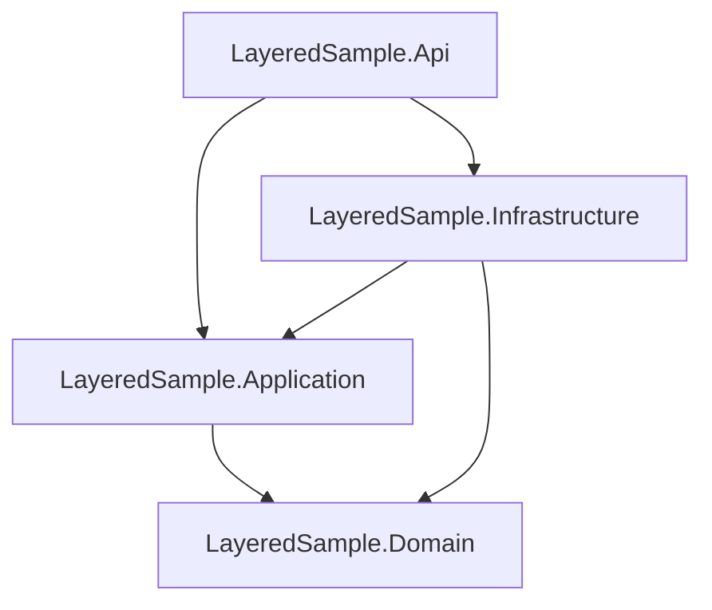
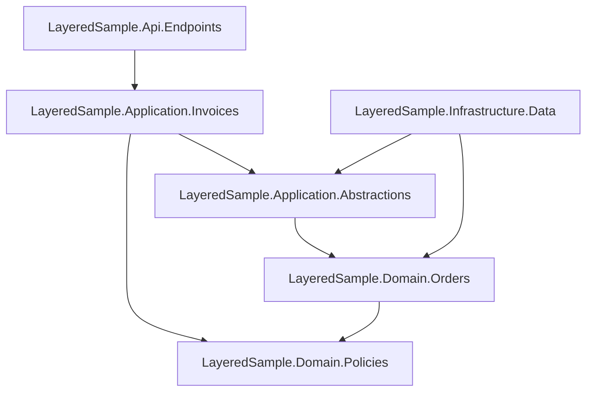
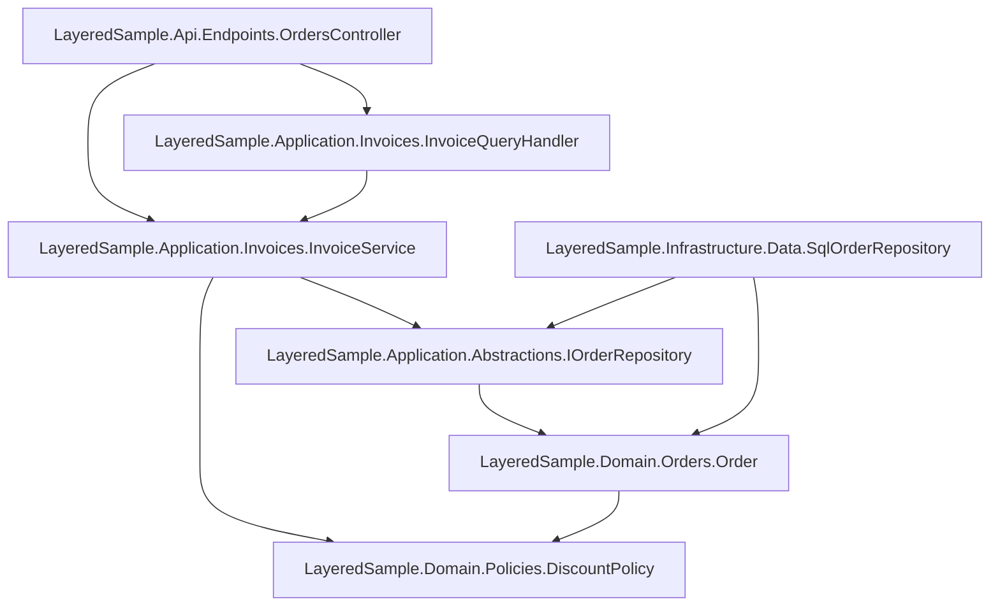
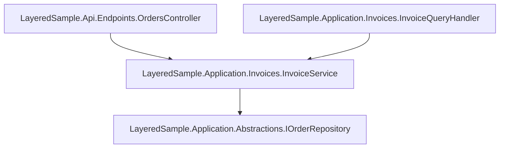

# Dependency Explorer Report

Generated from `LayeredSample.slnx`.

## Summary

Input path: `LayeredSample.slnx`

## Scope

- Level: All
- Focus project: none
- Focus namespace: none
- Focus class: none

## Counts

- Projects: 4
- Package references: 0
- Documents: 23
- Named types: 8
- Project dependency edges: 5
- Namespace dependency edges: 19
- Type dependency edges: 25
- Internal type dependency edges: 11
- External type dependency edges: 14
- Constructor DI edges: 5
- Project cycles: 0
- Namespace cycles: 0
- Type cycles: 0

## Analysis Options

- Classification: enabled
- Constructor DI graph: enabled

## Workspace Diagnostics

- None

## Projects

- `LayeredSample.Api`
  Path: `LayeredSample.Api/LayeredSample.Api.csproj`
  Frameworks: net10.0
  Documents: 5
  Project references: LayeredSample.Application, LayeredSample.Infrastructure
  Package references: none

- `LayeredSample.Application`
  Path: `LayeredSample.Application/LayeredSample.Application.csproj`
  Frameworks: net10.0
  Documents: 6
  Project references: LayeredSample.Domain
  Package references: none

- `LayeredSample.Domain`
  Path: `LayeredSample.Domain/LayeredSample.Domain.csproj`
  Frameworks: net10.0
  Documents: 7
  Project references: none
  Package references: none

- `LayeredSample.Infrastructure`
  Path: `LayeredSample.Infrastructure/LayeredSample.Infrastructure.csproj`
  Frameworks: net10.0
  Documents: 5
  Project references: LayeredSample.Application, LayeredSample.Domain
  Package references: none

## Top Type Fan-Out

- `LayeredSample.Api.Endpoints.OrdersController`: 2
- `LayeredSample.Application.Invoices.InvoiceService`: 2
- `LayeredSample.Infrastructure.Data.SqlOrderRepository`: 2
- `LayeredSample.Application.Abstractions.IOrderRepository`: 1
- `LayeredSample.Application.Invoices.InvoiceQueryHandler`: 1
- `LayeredSample.Domain.Orders.Order`: 1

## Top Type Fan-In

- `LayeredSample.Application.Abstractions.IOrderRepository`: 2
- `LayeredSample.Application.Invoices.InvoiceService`: 2
- `LayeredSample.Domain.Orders.Order`: 2
- `LayeredSample.Domain.Policies.DiscountPolicy`: 2
- `LayeredSample.Application.Invoices.InvoiceQueryHandler`: 1

## Cycle Summary

- Project cycles: 0 (largest: 0)
- Namespace cycles: 0 (largest: 0)
- Type cycles: 0 (largest: 0)

## Key Findings

- None

## Inventory

| Project | Classification | Documents | Package refs | Project refs | Notes |
| --- | --- | ---: | ---: | ---: | --- |
| LayeredSample.Api | Presentation (High) | 5 | 0 | 2 | presentation-oriented project name/path; runnable entrypoint project |
| LayeredSample.Application | Application (High) | 6 | 0 | 1 | application-oriented project name/path; LayeredSample.Application.Abstractions.IOrderRepository classified as Application |
| LayeredSample.Domain | Domain (High) | 7 | 0 | 0 | domain-oriented project name/path; LayeredSample.Domain.Orders.Order classified as Domain |
| LayeredSample.Infrastructure | Infrastructure (High) | 5 | 0 | 2 | infrastructure-oriented project name/path; LayeredSample.Infrastructure.Data.SqlOrderRepository classified as Infrastructure |

## Findings

No violations or warnings were produced for this run.

## Project Graph

## Namespace Graph

## Global Class Graph

## Global DI Graph

